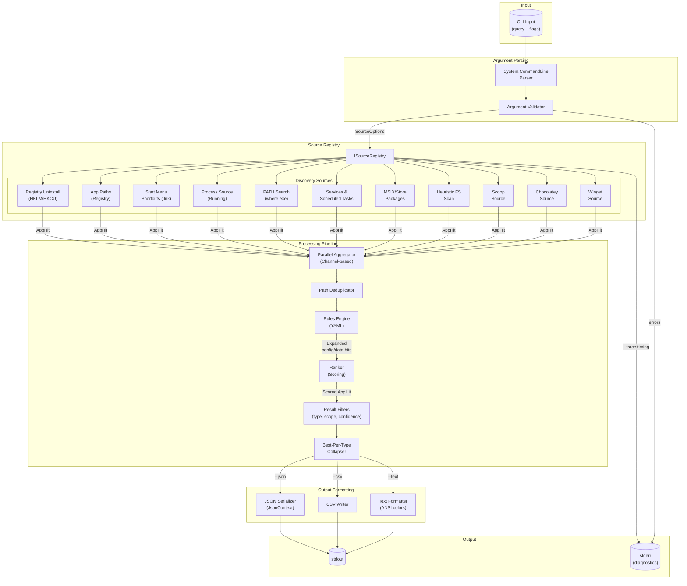
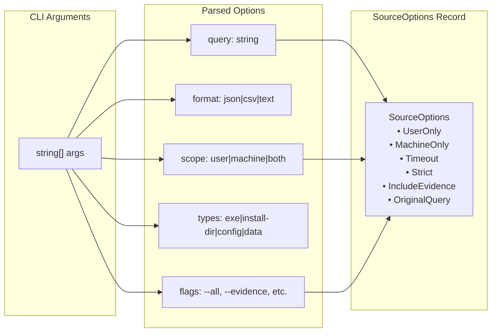
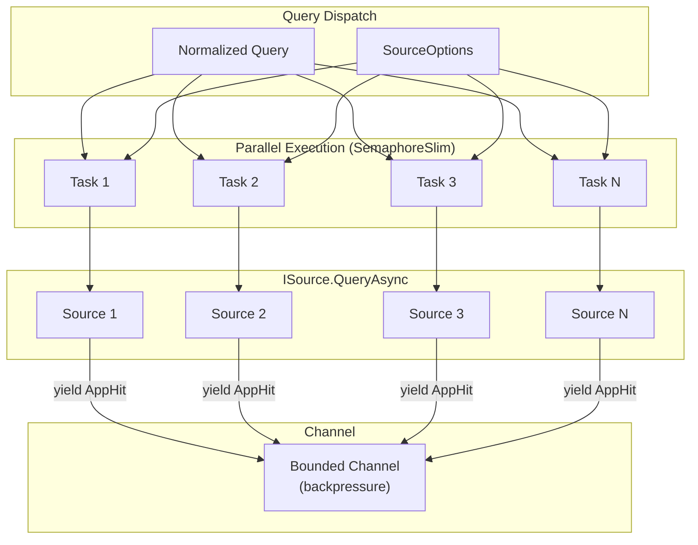
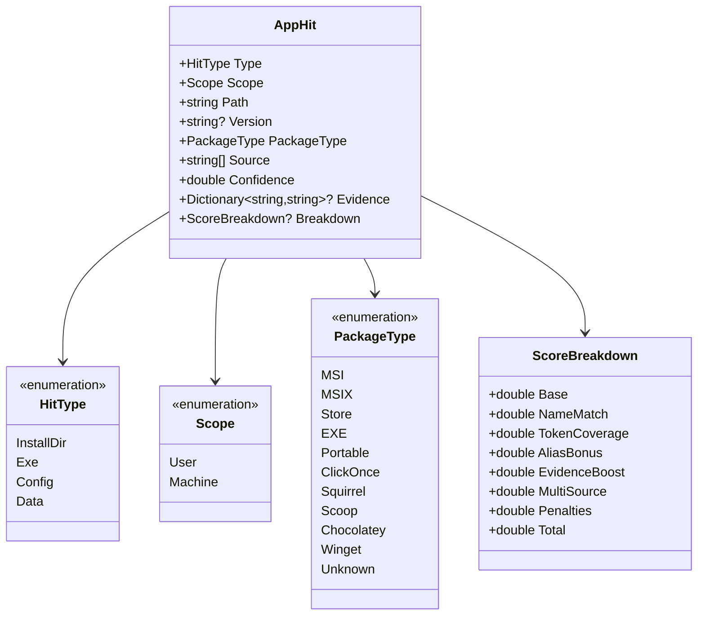
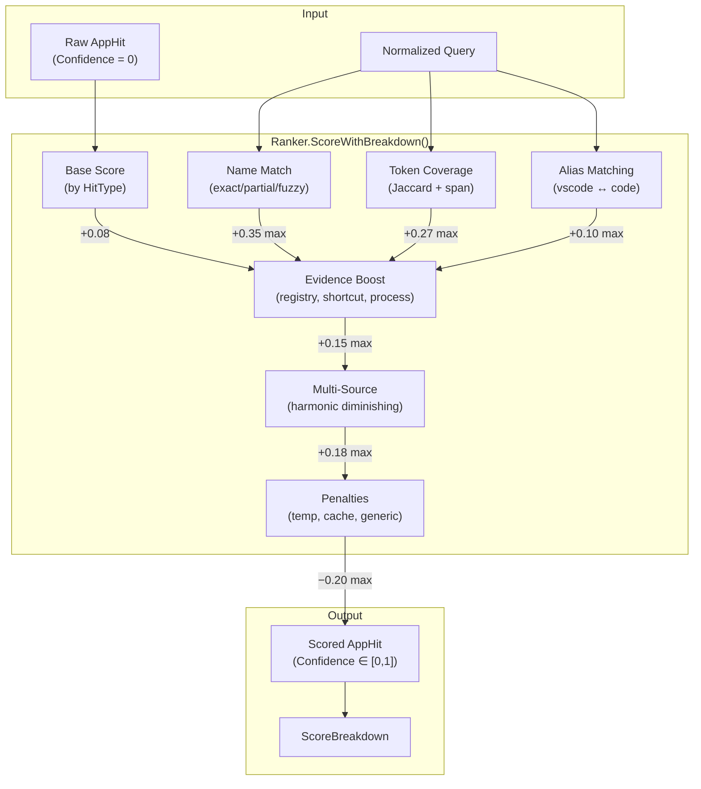
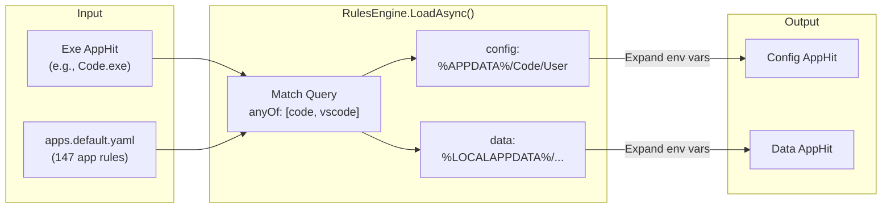
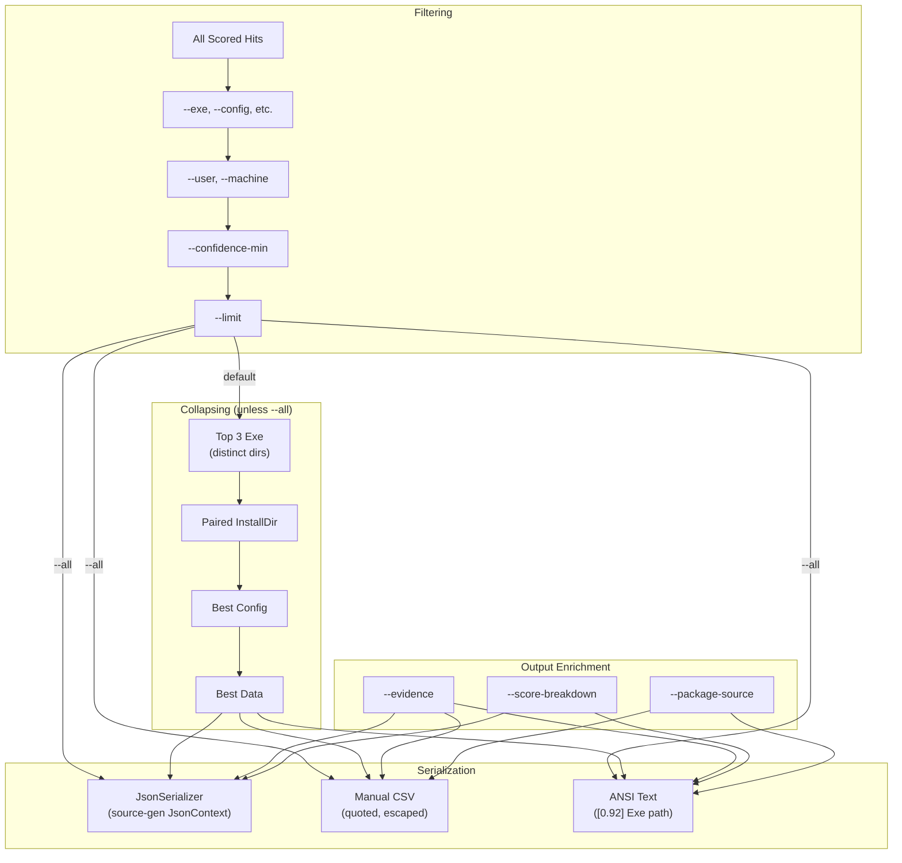
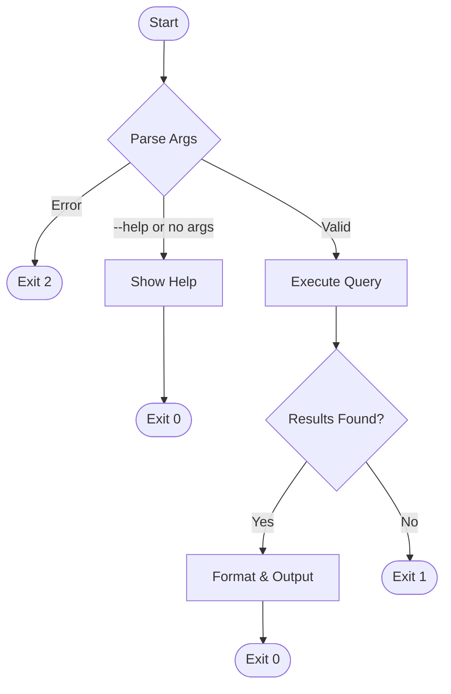

# AppLocate Dataflow Diagram

This document describes the data flow through the AppLocate application from user input to structured output.

## High-Level Overview

## Detailed Component Dataflow

### 1. Input Processing

### 2. Source Execution (Parallel)

### 3. AppHit Data Model

### 4. Ranking Pipeline

### 5. Rules Engine Expansion

### 6. Output Pipeline

## Source Data Origins

| Source | Windows API / Location | Returns |
|--------|------------------------|---------|
| **RegistryUninstallSource** | `HKLM/HKCU\Software\Microsoft\Windows\CurrentVersion\Uninstall` | InstallDir, Exe, Version |
| **AppPathsSource** | `HKLM/HKCU\Software\Microsoft\Windows\CurrentVersion\App Paths` | Exe |
| **StartMenuShortcutSource** | `%APPDATA%\Microsoft\Windows\Start Menu`, `%PROGRAMDATA%\...` | Exe (via .lnk target) |
| **ProcessSource** | `Process.GetProcesses()` | Exe (running) |
| **PathSearchSource** | `%PATH%` directories, `where.exe` | Exe |
| **ServicesTasksSource** | `sc query`, Task Scheduler | Exe |
| **MsixStoreSource** | `Windows.Management.Deployment.PackageManager` | InstallDir, Exe |
| **HeuristicFsSource** | Program Files, AppData (bounded scan) | Exe, InstallDir |
| **ScoopSource** | `~\scoop\apps`, `C:\ProgramData\scoop\apps` | Exe, InstallDir |
| **ChocolateySource** | `C:\ProgramData\chocolatey\lib` | Exe, InstallDir |
| **WingetSource** | `winget list --id` output | Exe, InstallDir |

## Exit Code Flow

---

*Generated for AppLocate v0.1.5 — See [README.md](../README.md) for CLI usage.*
